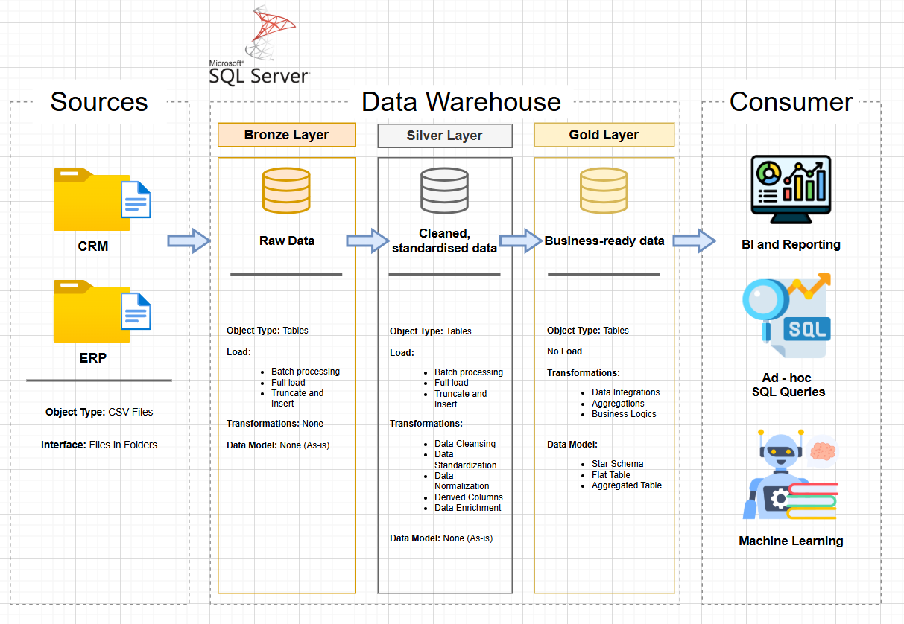

# Data Warehouse and Analytics Project

Welcome to the **Data Warehouse and Analytics Project** repository! 🚀

This is a project showcasing a comprehensive data warehousing and analytics solution, from designing and building a data warehouse to extracting actionable insights from the data, while adhering to industry best practices regarding data engineering and analytics.

## 📋Project Overview

The scope of this project includes:
1. **Data Architecture:** We will be designing the blueprints for our data warehouse. We will utilise the Medallion Architecture style which involves dividing our data infrastructure into three layers, namely: Bronze, Silver and Gold.
2. **ETL (Extract, Transform, Load):** We will utilise the ETL pipeline/process to get data from the defined sources into the data warehouse.
3. **Data Modelling:** We will be designing a data model (star schema), with fact and dimension tables effeciently designed for optimal analytical querying.
4. **Analytics and Reporting:** We will be developing dashboards and reports based on our SQL database structure to extract valuable business insights.

This project showcases expertise in Development with SQL, Data Architecture, Data Modelling, Data Engineering with ETL, and Analytics.

## 🧰Tools Used:
* **Datasets:** CSV files. Provided in the datasets folder of this repository.
* **Microsoft SQL Server Suite:** For hosting, managing and interacting with our database.
* **DrawIO:** For creating visual designs of various project aspects like the data architecture, warehouse layers and flow diagrams.
* **Notion:** For project management, organisation and tracking.

## 🚀Project Requirements

### Building the Data Warehouse (Data Engineering)

#### Objective
Develop a modern data warehouse using SQL Server to consolidate sales data, enabling analytical reporting and informed decision-making.

#### Specifications
- **Data Sources:** Import data from two source systems (ERP and CRM) provided as CSV files.
- **Data Quality:** Cleanse and resolve data quality issues prior to analysis.
- **Integration:** Combine both sources into a single, user-friendly data model designed for analytical queries.
- **Scope:** Focus on the latest dataset only; historization of data not required.
- **Documentation:** Provide clear documentation of the data model to support both business stakeholders and analytics teams.
  
  

### BI: Analytics and Reporting (Data Analytics)

#### Objective
Develop SQL-based analytics to deliver detailed insights into:
* **Customer Behaviour**
* **Product Performance**
* **Sales Trends**

These insights are meant to empower stakeholders with key business metrics, enabling more informed and strategic decision-making.

## Data Architecture

The Warehouse was built with the Medallion Architecture Strategy.

This involves building a `Bronze`, `Silver`, and `Gold` Layer in the warehouse:

1. **Bronze Layer:** Storage for data directly from the source system with no modifications. In this case, we get the csv files and store them in the database.
2. **Silver Layer:** Storage for transformed, cleaned, standardized data.
3. **Gold Layer:** Storage for business-ready data modelled in the appropriate schema (star in this case) ready for analysis and reporting. 

## 🛡️ License

This project uses the [MIT License](LICENSE). You have the freedom to use, modify and share the project given proper attribution.

## 📑About Me

Hello! My name is Cyrille Randy Omondi, a beginner data scientist and data engineer.

This is a showcase of what I can do as I continue to learn.

